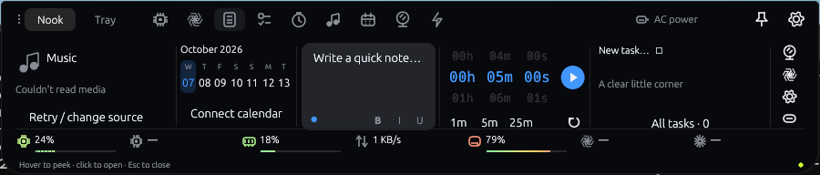
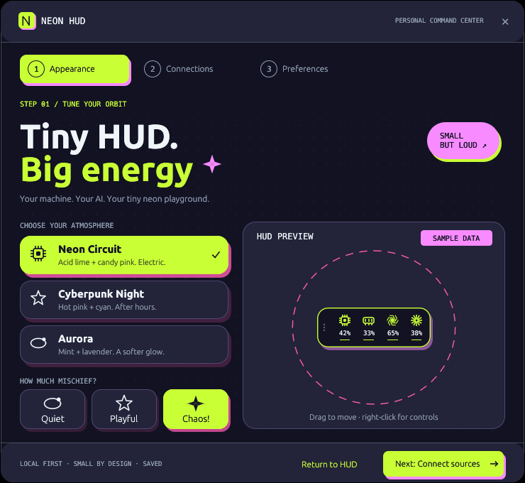

# Neon HUD · native Nook

A small, floating desktop utility for Windows and macOS: system performance, AI allowance and everyday tools in a native Rust capsule.

## Latest release: 0.2.0-alpha.6

[Download alpha.6](https://github.com/ajaxcbcb/neon-hud/releases/tag/v0.2.0-alpha.6) · [Feature guide](docs/FEATURES.md) · [Native setup and controls](src-native/README.md) · [Changelog](CHANGELOG.md) · [Release notes](docs/releases/v0.2.0-alpha.6.md) · [Validation](docs/VALIDATION.md)

Rust/egui/glow draws the floating HUD and custom neon frame directly. The new **Nook** presentation opens from a 240 × 40 capsule into a shallow panel of music, calendar, notes, timer, tasks and quick actions. Nook/Tray navigation and a numerical CPU/GPU/RAM/network/drives/Codex/Claude rail keep your tools and measurements together. Hover peeks, click opens, pin holds it open and Escape collapses it. Choose the layout and movable 160 × 56 compressed or 280 × 56 regular pill in **Preferences → Instruments**. Existing profiles keep their saved presentation; fresh profiles start in Nook.



Actual Windows cloud capture. System readings belong to the runner; unavailable media, calendar and AI sources are shown explicitly. See the [reference study](reference-learning/notchnook/study.md) for observed NotchNook states and the limits of the animation comparison.

Appearance, Connections and Preferences remain fixed setup steps. Theme cards, motion choices and a labeled sample pill retain the playful layout; settings have no scrolling or conventional OS title bar.



Actual Windows CI capture. The appearance preview is labeled **SAMPLE DATA**. Build, interaction and installation evidence is recorded separately in validation.

### Install

| Platform | Package | Start |
| --- | --- | --- |
| Windows x64 | `neon-hud-native-windows-x64-unsigned-preview.zip` | Extract the complete ZIP into a permanent folder, then run `neon-hud-native.exe`. |
| macOS Apple Silicon | Native arm64 DMG or app ZIP | Open the DMG and copy the app to Applications, or extract the complete app bundle. |

Keep the bundled license and notice files with the app. These are preview packages without OS code signing or macOS notarization. Native Intel Mac packages are not supplied in this release; the older WebView release has a universal Mac package.

The target Windows alpha.6 executable was subsequently quarantined by Microsoft Defender; target launch and Nook acceptance remain blocked. A separate self-signed development build is being verified through the [development signing workflow](docs/releases/MAINTENANCE.md#self-signed-windows-development-build). Its certificate is not publicly trusted and does not clear a Defender detection. It does not replace the published alpha.6 assets or update feed.

The first configuration step is **Appearance**, followed by **Connections** and **Preferences**. Pick Neon Circuit, Cyberpunk Night or Aurora, and Quiet, Playful or Chaotic motion. **Preferences → Instruments** chooses Nook or the floating pill, selected drives and metrics. **Preferences → Startup & updates** controls login startup and updates. Startup is opt-in; replacing an installation should preserve its existing enabled/disabled choice.

### Controls and must-keeps

| Interaction | Result |
| --- | --- |
| Hover Nook / click Nook | Peek / open the shallow widget panel. |
| Pin / Escape | Hold Nook open / collapse it. |
| Nook / Tray | Widget overview / saved file references. |
| Pill drag grip / double-click grip | Move / compress or restore the pill. |
| Right-click or Shift+F10 | Native Settings, compression, pause/resume, hide, reset position and Quit controls. |
| Tray or menu bar | Restore the HUD, configure it or quit; hiding keeps it available. |

CPU/GPU/RAM, upload/download rates, multiple drives and Codex/Claude allowance retain numerical values, gradient stress meters and detailed views. Screen-aware popovers open inward at edges and corners. Attention badges describe sustained load, supported temperature readings, low free space or a Claude question. Motion respects reduced-motion preferences and quiets under resource pressure.

Media playback, calendar, notes, tasks, deadline timers, battery, an opt-in camera mirror and quick actions live beside the metrics. Utilities store bounded local data separately from the profile. Availability depends on supported OS sources and permissions; details are in the [feature guide](docs/FEATURES.md).

### Persistent connections and signed updates

**Codex:** connect through the official Codex CLI/app-server. Saved connection intent and last-known allowance survive retry failures and restarts; stale readings retain their original time. Explicit disconnect clears them. Codex allowance describes Codex account usage; ordinary ChatGPT chat allowance has no supported local source.

**Claude:** enable the reversible Claude Code statusline/hook bridge from Connections. Existing owned version paths can migrate without replacing unrelated Claude settings. Configured, waiting, connected and error states are distinct. Authentication remains with Claude Code; a configured bridge needs Claude Code to provide an actual reading.

Five-hour and other windows appear only when reported by the provider. Allowance drain averages fresh consumption against elapsed time and estimates depletion at the current pace. Exact cumulative spent-token counts are unavailable from these quota sources; allowance percentages are not relabeled as token counts.

Alpha.3 and later use **Check now → Download update → Restart and update**. Automatic checks and low-pressure downloads are configurable; native replacement requires the restart action. Signed metadata, archive hashes and signatures are verified before installation, with saved preferences, a normal exit and replacement acknowledgement. The [public alpha.4 → alpha.6 GUI update](https://github.com/ajaxcbcb/neon-hud/actions/runs/37663561512) passed, including tamper rejection and retained Pill/settings/startup. This native feed is separate from the older WebView feed.

The renderer contains no WebView. Codex still uses its official helper, so connector-inclusive single-process operation and full-machine performance targets remain unproved. Windows and Mac build/package checks passed; Mac permission and hardware behavior require target runtime checks. See [validation](docs/VALIDATION.md) for the evidence boundary.

## Legacy WebView release: 0.1.4

The older release uses Rust, Tauri 2, Svelte and SVG instruments. Its setup executables, universal Mac DMG, Anime.js effects and automatic-install policy belong to that renderer. The following sections document that release; its stable updater manifest remains separate from the native preview.

[Download the preview release](https://github.com/ajaxcbcb/neon-hud/releases) · [Feature introduction](docs/FEATURES.md) · [Changelog](CHANGELOG.md) · [Release notes](docs/releases/v0.1.4.md)


Sample readings above. The floating window is 280 × 56 pixels at default scale; the visible capsule is 272 × 48.

## Install and first launch

Get preview installers from [GitHub Releases](https://github.com/ajaxcbcb/neon-hud/releases). Packages are built by [GitHub Actions](https://github.com/ajaxcbcb/neon-hud/actions). Windows: download the x64 NSIS setup executable and follow the installer. Mac: open the universal DMG and drag Neon HUD to Applications. Preview installers are not OS code-signed or notarized. Application update packages have a separate cryptographic signature verified by Neon HUD.

The first page after installation is **Appearance**: choose Neon Circuit, Cyberpunk Night or Aurora, choose Chaotic, Playful or Quiet motion, then size. The default is a 280 × 56 floating pill on the right side, with six placement choices and optional text scaling. Hover reveals measurements; click opens the larger meters and graphs. A clearly marked sample HUD previews your choices. Next connect optional AI sources, then choose metrics and alerts. System monitoring works without an AI connection. Existing users can select **Appearance → Pill** to switch from an expanded layout.

Hover or focus any metric for numerical details and pressure explanations. Right-click the HUD (or press Shift+F10) for expand, pause/resume, pin, theme, motion, refresh, settings and hide controls. Open the gear or tray/menu-bar **Configure** item to change settings later. **Preferences → Launch Neon HUD at login** enables Windows startup or a macOS login agent; switching it off removes that registration. It defaults to off. Closing the HUD hides it to the tray; use **Quit** to exit.

## Measurements

- CPU: total utilization, per-core bars and reported frequency. Temperatures appear only when supported by the machine.
- GPU: select an adapter or automatically show the busiest reported adapter. Windows uses DXGI identity and PDH activity/dedicated-memory counters. Mac uses Metal identity; global activity, memory usage and temperature remain unavailable where the supported source cannot report them. Expand for every adapter and its capability/source details.
- RAM: used/total GiB and utilization percentage.
- Network: download/upload MiB/s, 60-second bars and interface transfer totals. Automatic selection uses one default-route interface, avoiding aggregate VPN double counting. Select another interface if the route cannot be determined.
- Storage: mounted-volume capacity percentage and used/free/total GiB. Select drives in Preferences or include all detected drives automatically. Disconnected selections remain in settings until forgotten.
- Stress: green → amber → hot pink gradients on gauges and bars. AI allowance reverses the scale as remaining allowance falls. Numerical readings and **!** badges accompany colors. CPU/GPU/RAM badges require 10 seconds of sustained pressure; high reported temperature and low free space warn immediately. Thresholds are configurable; thermal throttling is not measured. Network colors show recent relative activity, not link capacity or proof of congestion.
- AI: percentage remaining, provider-reported windows and reset times. A five-hour window appears only if the provider reports one. Weekly and other windows remain separate. Missing data is unavailable; old data is marked stale; expired timers await a refresh.
- Drain: a time-weighted average of allowance consumption over up to 30 minutes, requiring at least two minutes of fresh readings. Shows percentage/hour and estimated time to exhaustion. **Fast drain** means exhaustion is projected before the reported reset. This estimate assumes the same pace; it is not a provider guarantee. Cached snapshots do not count as new measurements; resets restart the observation. Allowance percentage is not a token count.

Exact cumulative token counts are unavailable from the connected quota sources. The fast-drain indicator therefore measures reported allowance consumption against elapsed time. Claude context-window token counts describe the current context, not cumulative consumption, and are not relabeled as tokens spent.

## AI connections

**Codex:** install the official Codex CLI and select Connect Codex. Neon HUD uses its supported local app-server and provider-managed sign-in. It reads Codex account allowance; this does **not** describe ordinary ChatGPT chat quotas. An automatic supported ChatGPT chat allowance source is unavailable in this version. Existing Codex desktop conversations are not observed for questions.

**Claude:** install Claude Code, sign in with `claude auth login`, then select Enable bridge. The button shows progress immediately and confirms the installed statusline and seven hooks. **Waiting for readings** means configuration succeeded but no supported account-limit reading has arrived. Start or resume Claude Code and use it normally; the local statusline receives supported account-limit readings when Claude Code supplies them. Claude and Claude Code share these limits when using the same account; the HUD does not add the two together. The bridge also observes explicit questions and permission requests. The icon shakes briefly, then retains a question badge until resolved or dismissed. Reduced-motion preferences replace the shake with a static badge.

The Claude bridge backs up settings, preserves other hooks and chains an existing statusline. **Remove bridge before uninstalling Neon HUD**, so Claude settings do not reference a removed executable. Removal changes only the HUD's configuration; your unrelated settings stay in place. No automatic approvals are issued.

## Privacy and performance

Settings and minimal readings stay in per-user application data. No telemetry, passwords, API keys or conversation content are collected. Provider authentication stays with the installed provider CLI. The interface uses bundled Latin fonts, SVG gauges and CSS bars. Anime.js adds short interaction bursts capped at 24 particles, removed after completion. Chaotic mode adds staggered transform animations to small icons; Playful uses interaction motion and Quiet disables motion. System reduced-motion preferences override all modes.

Smart resource mode is on by default. Sustained CPU/GPU/RAM pressure or high reported temperature slows checks and quiets motion without changing your saved motion choice. The AUTO chip and expanded resource strategy show the reason and suggested actions. Hidden UI polling pauses; manual refresh remains available while paused. The app adjusts its own budget; it does not close other apps or change OS power settings.

| Resource mode | CPU/RAM/network | GPU | Sensors | AI checks | Drive cache | Route cache | CPU clock cache |
| --- | --- | --- | --- | --- | --- | --- | --- |
| Normal | 250ms default; 250/500/1000/2000ms selectable | 1s | 2s | 5s | 30s | 30s | 15s |
| Pressure | 4s | 4s | 4s | 10s | 90s | 60s | 30s |
| Critical | 8s | 8s | 8s | 15s | 180s | 120s | 60s |

Critical mode starts after sustained ≥98% CPU/GPU or ≥97% memory (subject to higher configured thresholds), or a sensor ≥10°C above its configured threshold. Recovery needs 20 seconds of fresh readings comfortably below thresholds per step. Missing/stale readings cannot prove recovery. Turn adaptation off in Preferences for the normal budget. Provider refresh cadence may be slower than UI checks; cached readings are not relabeled as new.

Gauges and bar widths use finite 180ms display-synced transitions, with no fixed 60 Hz cap. Numerical values remain the latest measured samples. Idle meters schedule no animation frames; hidden and reduced-motion displays settle immediately. Actual native frame rate requires measurement on the installed machine.

Performance targets are under 1% idle CPU and a small full-process memory footprint. These are targets until measured on each platform, including WebView and provider helper processes. See [validation](docs/VALIDATION.md) for evidence and limitations.

## Application updates

Preferences enables automatic update checks at startup and every six hours, including while hidden in the tray. Automatic checks defer during high resource pressure. Available packages download in the background and must pass signature verification before installation.

From 0.1.3, enable **Automatically install updates and restart** to authorize future upgrades. A verified package waits at least one minute, with no HUD interaction during the last minute. Open settings or provider details, pending questions, connection attempts, paused monitoring, unsaved preferences and high resource pressure defer the restart. A fresh system/provider preflight also runs from the tray before installation; unavailable readings defer it. Only one preflight per minute runs while a verified package is waiting. Existing users keep automatic installation off until they choose it. Disable either update switch to prevent automatic installation; **Install & restart** remains available manually. An installation failure waits for a manual retry rather than restarting repeatedly.

Updates use the public [`updates/latest.json`](updates/latest.json) manifest and versioned GitHub Release assets. The first 0.1.0 installation must be upgraded with the installer. See [release maintenance](docs/releases/MAINTENANCE.md) for the signed publishing gate.

## Develop

Native Rust application:

```sh
cargo test --manifest-path src-native/Cargo.toml --locked
cargo run --manifest-path src-native/Cargo.toml --locked --release
```

Native Windows/macOS packaging and interaction gates run in [native.yml](.github/workflows/native.yml); public signed-upgrade acceptance runs in [native-update-proof.yml](.github/workflows/native-update-proof.yml). See [release maintenance](docs/releases/MAINTENANCE.md).

Legacy WebView application:

Install Node.js 24, Rust stable and the [Tauri platform prerequisites](https://v2.tauri.app/start/prerequisites/).

```sh
npm ci
npm run verify
cargo test --manifest-path src-tauri/Cargo.toml
npm run tauri dev
```

Browser-only preview: `npm run dev`. It displays sample data only on the appearance page; real system and account sources require the native app.

Unsigned developer Windows installer: `npm run tauri build -- --bundles nsis --config src-tauri/tauri.pr.conf.json`.
Unsigned developer Mac universal installer: add Rust targets `aarch64-apple-darwin` and `x86_64-apple-darwin`, then `npm run tauri build -- --target universal-apple-darwin --bundles dmg --config src-tauri/tauri.pr.conf.json`. Trusted CI builds require the repository's update signing secret; fork pull requests use the unsigned developer configuration.

## License

Licensed under **MIT OR Apache-2.0**, at your option. See [LICENSE-MIT](LICENSE-MIT), [LICENSE-APACHE](LICENSE-APACHE), [NOTICE](NOTICE) and [third-party notices](THIRD-PARTY-NOTICES.md). Provider names and logos identify integrations; they remain their owners' trademarks. This project is independent and is not endorsed by OpenAI or Anthropic.
